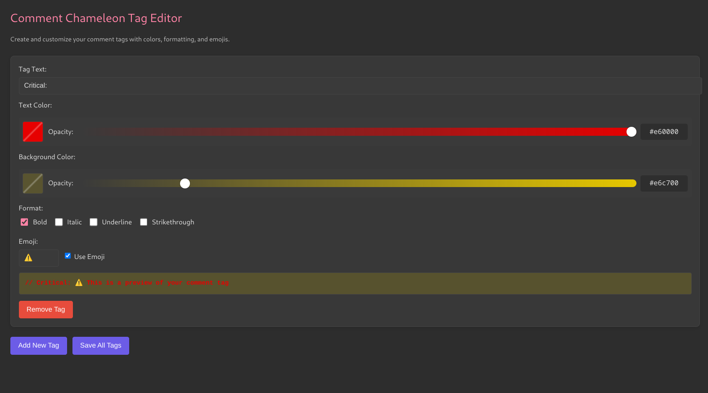

# Better Comments Enhanced

Enhances the popular Better Comments extension with emoji-based comment tags and snippets.

## Features

- Automatically applies styled comment tags for various categories (TODO, FIXME, BUG, etc.)
- Includes snippets for quick insertion of formatted comments
- Works with JavaScript, TypeScript, Python, HTML, and more
- **NEW**: Custom tag creation and styling
- **NEW**: Formatting options like bold, italic, underline, and strikethrough

## Usage

### Comment Tags

Type any of these snippets followed by Tab:

- `critical` - Creates a critical warning comment
- `todo` - Creates a todo comment
- `fixme` - Creates a fixme comment
- `bug` - Creates a bug comment
- ... and many more!

### Custom Tags

You can create and customize your own tags with our visual editor:

1. Open the Command Palette (`Ctrl+Shift+P` or `Cmd+Shift+P` on Mac)
2. Type "Comment Chameleon" and select "Edit Custom Comment Tags"
3. The Tag Editor will open with your existing tags (or sample tags for new users)

   

   

4. Customize each tag with these options:

   - **Tag Text**: The text that identifies your comment (e.g., "CRITICAL:", "TODO:")
   - **Text Color**: Choose any color and adjust opacity for the comment text
   - **Background Color**: Add and customize a background highlight
   - **Format**: Apply bold, italic, underline, or strikethrough styling
   - **Emoji**: Add a custom emoji and toggle whether it appears

5. Preview your changes in real-time at the bottom of each tag editor
6. Click "Add New Tag" to create additional custom tags
7. When finished, click "Save All Tags" and reload when prompted

Your custom tags will be immediately available as snippets and will appear styled in your code comments!

## Comment Types

| Type                           | Description               |
| ------------------------------ | ------------------------- |
| `CRITICAL: ⚠️`                 | Critical sections of code |
| `TODO: 📋`                     | Todo items                |
| `FIXME: 🔧`                    | Things that need fixing   |
| `BUG: 🐛`                      | Known bugs                |
| `HACK: ⚡`                     | Hacky solutions           |
| `NOTE: 📝`                     | Important notes           |
| ... plus your own custom tags! | ...                       |

## Extension Settings

If you need to manually apply the enhanced styles, use the command:
`Better Comments Enhanced: Apply Enhanced Comment Styles`

To edit your custom tags:
`Better Comments Enhanced: Edit Custom Comment Tags`

## Emoji Support

Better Comment Tags supports emojis for visual distinction in comments:

### Default Emojis

Each built-in tag comes with a default emoji like:

- TODO: 📋
- FIXME: 🔧
- BUG: 🐛

### Customizing Emojis

When creating or editing custom tags, you can:

1. Use the emoji field to set a custom emoji
2. Toggle the "Use emoji" checkbox to enable/disable emoji for that tag
3. Leave the emoji field empty to use the default mapping

### Global Emoji Setting

You can globally enable or disable emojis in Settings:
`betterCommentsEnhanced.useEmojis`: true/false

### Using Snippets

When typing a tag name (e.g., "todo"), the snippet will automatically include the appropriate emoji if enabled.
